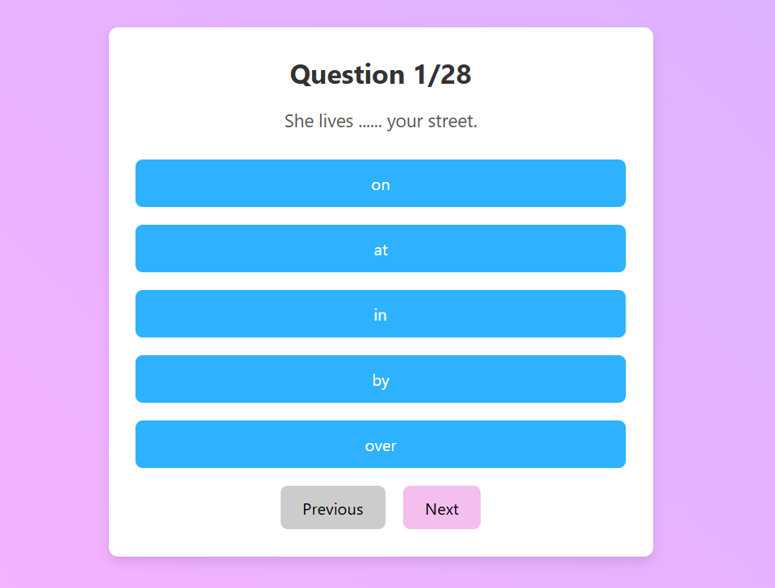
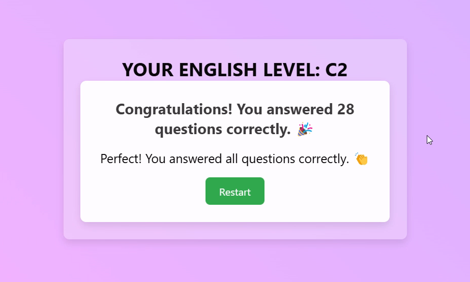

# Quiz App

This project is a quiz application that allows users to take a quiz and evaluate their English level based on their answers. The app keeps track of correct and incorrect answers, displays a score, and provides feedback on the user's English level.

## Demo

Check out the demo video of the Quiz App:
[Quiz App Demo Video](./assets/quiz-app.mp4)




## Technologies Used

- **React**: Used to build the user interface.
- **JavaScript (ES6+)**: Utilized for logic and interactivity.
- **CSS**: Used for styling the application.

## Features

- **Quiz Questions**: Users can answer multiple-choice questions.
- **User Level Evaluation**: Based on correct answers, users receive an English proficiency level.
- **Feedback on Incorrect Answers**: Incorrect answers are shown with the correct answers for learning.
- **Question Navigation**: Users can navigate through questions using next and previous buttons.


## Setup Information

To get the project up and running locally, follow these steps:

1. **Clone the Project Repository**:
   ```bash
   git clone https://github.com/batux4n/quiz-app.git

## Navigate into the project directory:
bash
cd quiz-app

## Install the dependencies:
npm install

## Start the development server:
npm start

## Contributing
Feel free to fork the repository and submit a pull request if you'd like to contribute to the project.

## License

This project is open-source and available under the [MIT License](LICENSE).
